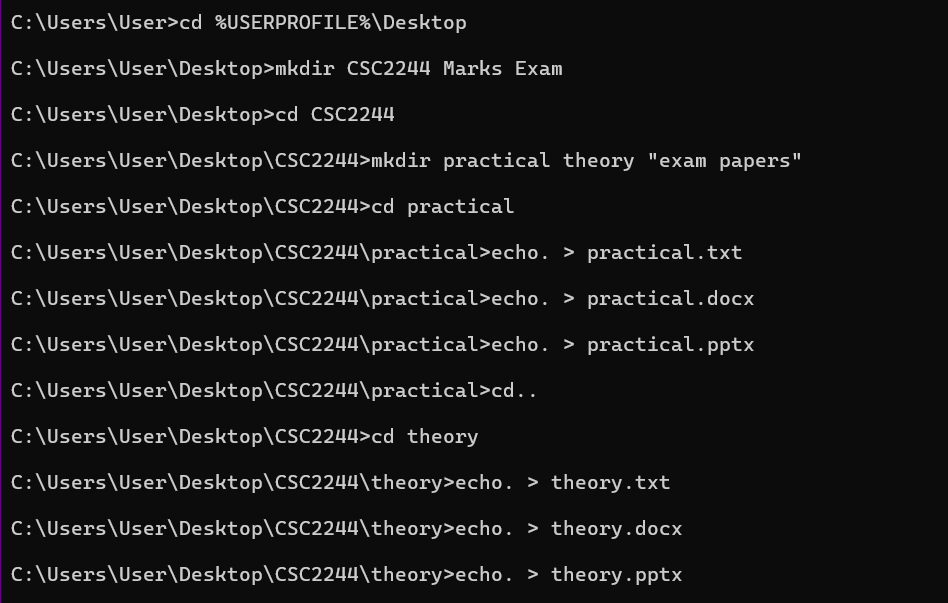
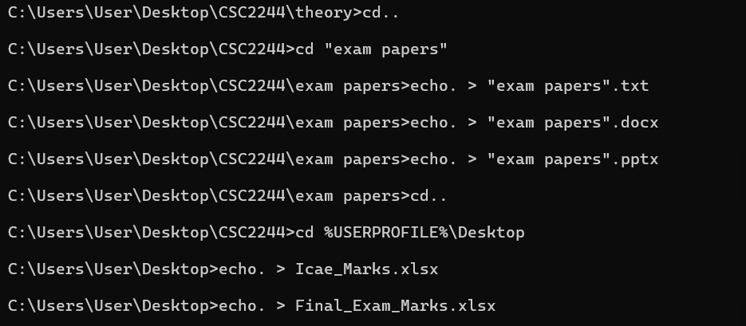
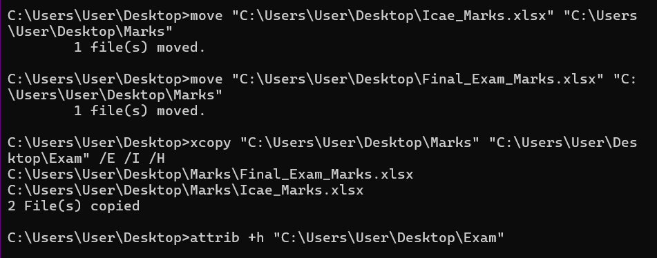
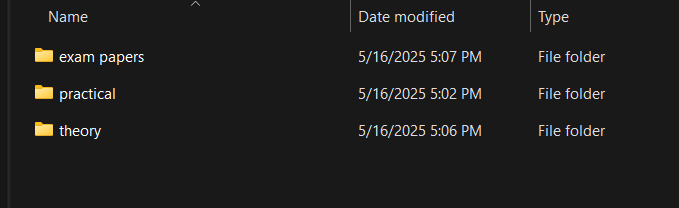
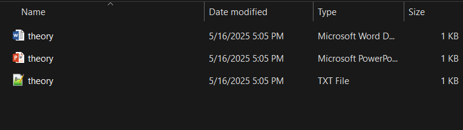
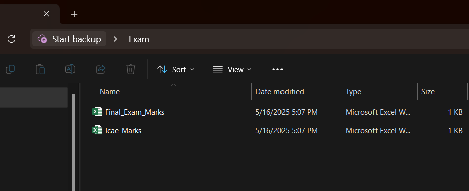
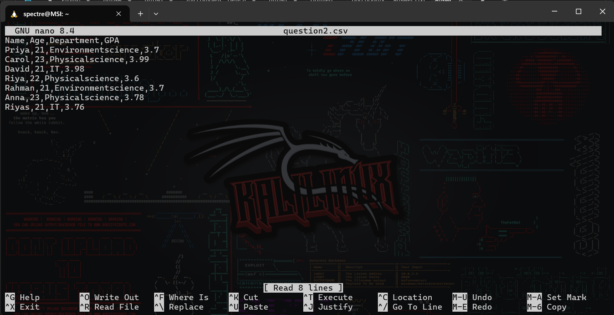
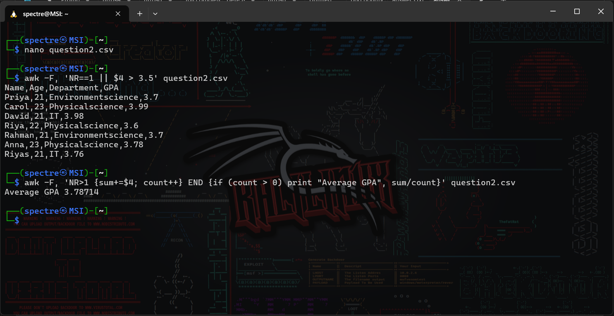
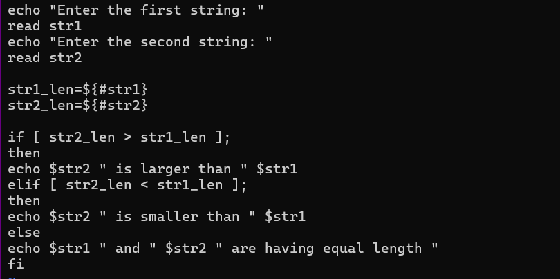
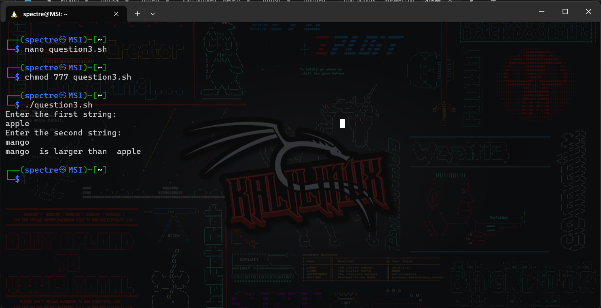

# Operating System Course - Day 11

[](https://learn.microsoft.com/en-us/windows-server/administration/windows-commands/windows-commands)
[](https://www.microsoft.com/windows)
[]()
[]()

## 📋 Daily Content

### 🎯 Programming Exercises

#### 1. Folder/File Automation (`answer1.txt`)
```bash
# Code from Codes directory
```
**Explanation:**
- Batch script for automated folder structure creation
- Implements directory traversal and file management

#### 2. CSV Processing (`answer2.txt`)
```bash
# Code from Codes directory
```
**Explanation:**
- AWK commands for GPA filtering and calculation
- Demonstrates text processing and data analysis

#### 3. String Comparison (`answer3.txt`)
```bash
# Code from Codes directory
```
**Explanation:**
- Bash script for string length comparison
- Implements conditional logic and variable manipulation

### 📊 Implementation Results

| Program | Description | Output |
|---------|-------------|--------|
| Folder Automation | Directory structure creation |  |
| GPA Analysis | CSV data processing |  |
| String Comparison | Length comparison logic |  |

<div align="center">
📖 **Learning Path** | 🛠️ **Practical Examples** | 📊 **Visual Outputs**
</div>

## Implementation Structure

| Category | File | Description | Visual Output |
|----------|------|-------------|---------------|
| Answer 1 | `answer1.txt` | Batch script for folder/file automation |  |
| Answer 2 | `answer2.txt` | AWK commands for CSV processing |  |
| Answer 3 | `answer3.txt` | Shell script for string length comparison |  |
| Output 4 |  |  |  |
| Output 5 |  |  |  |
| Output 6 |  |  |  |
| Output 7 |  |  |  |
| Output 8 |  |  |  |
| Output 9 |  |  |  |
| Output 10 |  |  |  |
| Output 11 |  |  |  |
| Output 12 |  |  |  |
| Output 13 |  |  |  |

#### 1. Answer 1 (`answer1.txt`)
This batch script automates folder and file creation, file moving, copying, and attribute setting on the Desktop.

**Line-by-line explanation:**
1. `cd %USERPROFILE%\Desktop` — Changes directory to the user's Desktop.
2. `mkdir CSC2244 Marks Exam` — Creates a folder named "CSC2244 Marks Exam".
3. `mkdir practical theory "exam papers"` — Creates three subfolders: practical, theory, and exam papers.
4. `cd practical` — Enters the practical folder.
5. `echo. > practical.txt` — Creates an empty file named practical.txt.
6. `echo. > practical.docx` — Creates an empty file named practical.docx.
7. `echo. > practical.pptx` — Creates an empty file named practical.pptx.
8. `cd..` — Moves up one directory.
9. `cd theory` — Enters the theory folder.
10. `echo. > theory.txt` — Creates an empty file named theory.txt.
11. `echo. > theory.docx` — Creates an empty file named theory.docx.
12. `echo. > theory.pptx` — Creates an empty file named theory.pptx.
13. `cd..` — Moves up one directory.
14. `cd "exam papers"` — Enters the exam papers folder.
15. `echo. > "exam papers".txt` — Creates an empty file named exam papers.txt.
16. `echo. > "exam papers".docx` — Creates an empty file named exam papers.docx.
17. `echo. > "exam papers".pptx` — Creates an empty file named exam papers.pptx.
18. `cd..` — Moves up one directory.
19. `cd %USERPROFILE%\Desktop` — Returns to Desktop.
20. `echo. > Icae_Marks.xlsx` — Creates an empty Excel file named Icae_Marks.xlsx.
21. `echo. > Final_Exam_Marks.xlsx` — Creates an empty Excel file named Final_Exam_Marks.xlsx.
22. `move "C:\Users\User\Desktop\Icae_Marks.xlsx" "C:\Users\User\Desktop\Marks"` — Moves Icae_Marks.xlsx to the Marks folder.
23. `move "C:\Users\User\Desktop\Final_Exam_Marks.xlsx" "C:\Users\User\Desktop\Marks"` — Moves Final_Exam_Marks.xlsx to the Marks folder.
24. `xcopy "C:\Users\User\Desktop\Marks" "C:\Users\User\Desktop\Exam" /E /I /H` — Copies the Marks folder and its contents to Exam, including subfolders and hidden files.
25. `attrib +h "C:\Users\User\Desktop\Exam"` — Sets the Exam folder as hidden.

#### 2. Answer 2 (`answer2.txt`)
This file demonstrates AWK commands for processing a CSV file and calculating averages.

**Line-by-line explanation:**
1. `awk -F, 'NR==1 || $4 > 3.5' question2.csv` — Prints the header and rows where the 4th column (GPA) is greater than 3.5.
2. `awk -F, 'NR>1 {sum+=$4; count++} END {if (count > 0) print "Average GPA", sum/count}' question2.csv` — Calculates and prints the average GPA, skipping the header.
3. `nano question2.csv` — Opens the CSV file for editing in nano.
4. The next block shows the output of the first AWK command: header and all students with GPA > 3.5.
5. The next block shows the output of the second AWK command: prints the average GPA value.

#### 3. Answer 3 (`answer3.txt`)
This shell script compares the lengths of two input strings and prints which is longer, shorter, or if they are equal.

**Line-by-line explanation:**
1. `echo "Enter the first string: "` — Prompts the user for the first string.
2. `read str1` — Reads the first string into variable str1.
3. `echo "Enter the second string: "` — Prompts the user for the second string.
4. `read str2` — Reads the second string into variable str2.
5. `str1_len=${#str1}` — Gets the length of str1.
6. `str2_len=${#str2}` — Gets the length of str2.
7. `if [ str2_len > str1_len ];` — Checks if the second string is longer.
8. `echo $str2 " is larger than " $str1` — Prints if the second string is longer.
9. `elif [ str2_len < str1_len ];` — Checks if the second string is shorter.
10. `echo $str2 " is smaller than " $str1` — Prints if the second string is shorter.
11. `else` — Otherwise (lengths are equal).
12. `echo $str1 " and " $str2 " are having equal length "` — Prints if both strings are equal in length.
13. `fi` — Ends the if-else block.
14. The rest shows example terminal usage and output for the script.


<div align="center">

📖 **Learning Path** | 🛠️ **Practical Examples** | 📊 **Visual Outputs**

</div>
