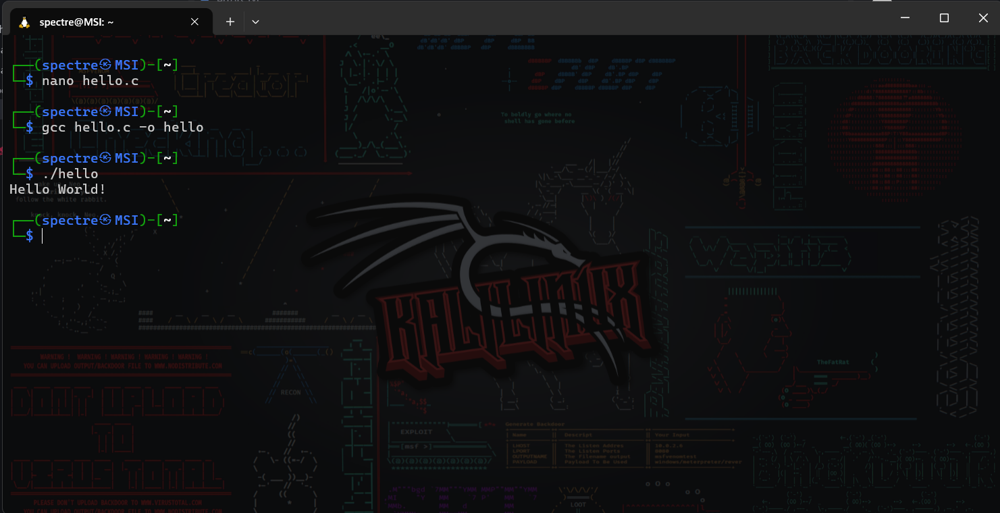
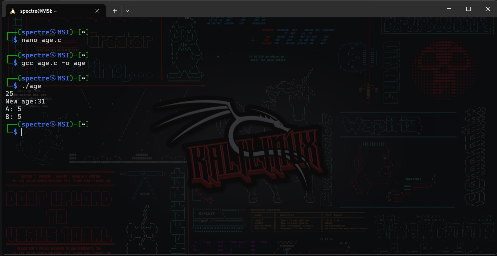
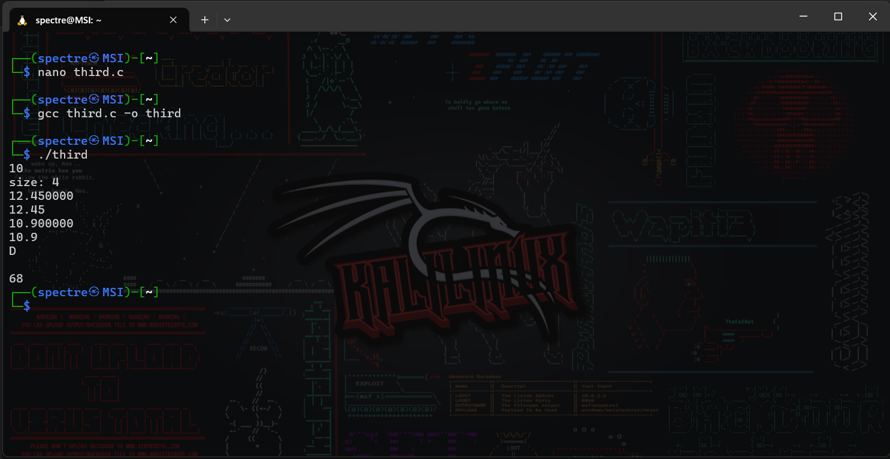
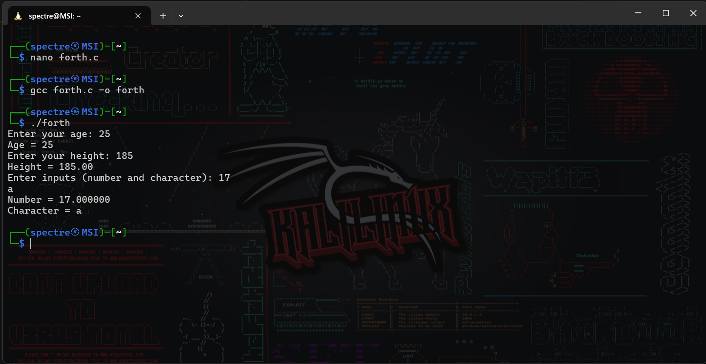
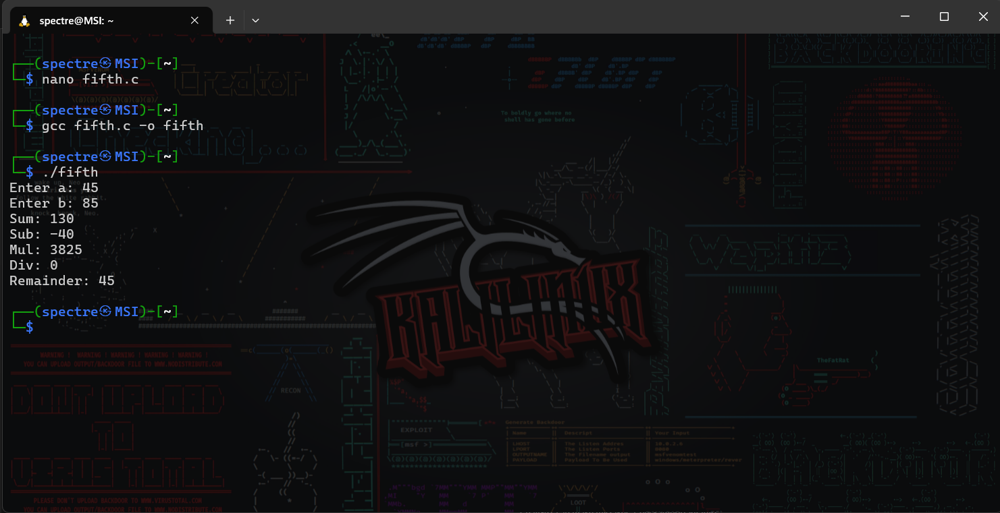

# Operating System Course - Day 12

[](https://en.cppreference.com/w/c)
[](https://www.microsoft.com/windows)
[]()
[]()

## 📋 Daily Content

### 🎯 Programming Exercises

#### 1. Hello World (`01.txt`)
```c
#include<stdio.h>
int main() {
    printf("Hello World!\n");
    return 0;
}
```
**Explanation:**
- Basic C program structure
- Output demonstration

#### 2. Variables & Data Types (`02.txt`, `03.txt`)
```c
int age = 25;
double height = 175.5;
char initial = 'A';
```
**Explanation:**
- Integer, floating point and character variables
- Format specifiers usage

#### 3. User Input Handling (`04.txt`)
```c
scanf("%d", &age);
scanf("%lf", &height);
```
**Explanation:**
- Input validation techniques
- Type matching importance

#### 4. Calculator Implementation (`5.txt`)
```c
printf("Sum: %d\n", (a+b));
```
**Explanation:**
- Arithmetic operations
- Integer division vs floating point results

### 📊 Implementation Results

| Program | Description | Output |
|---------|-------------|--------|
| Program | Description | Output |
|---|---|---|
| Hello World | Basic output demonstration |  |
| Variables | Data type demonstrations |  |
| Data Types | Size verification |  |
| User Input | Multi-type validation |  |
| Calculator | Arithmetic operations |  |

<div align="center">
📖 **Fundamentals** | 🛠️ **Type Systems** | 📊 **I/O Operations**
</div>