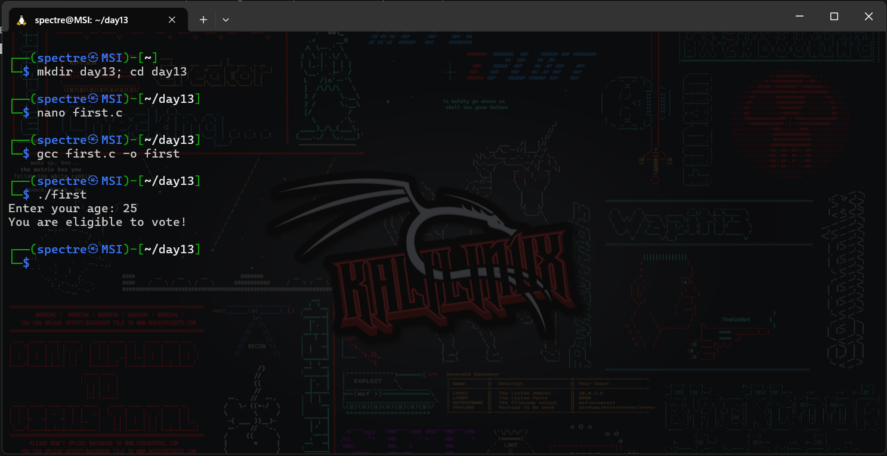
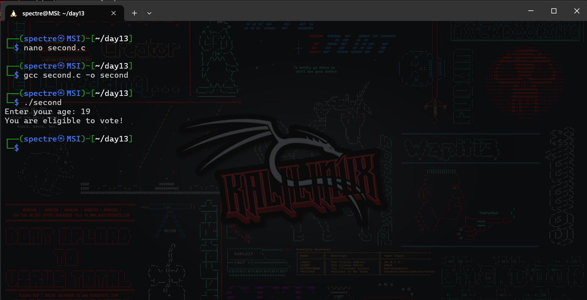
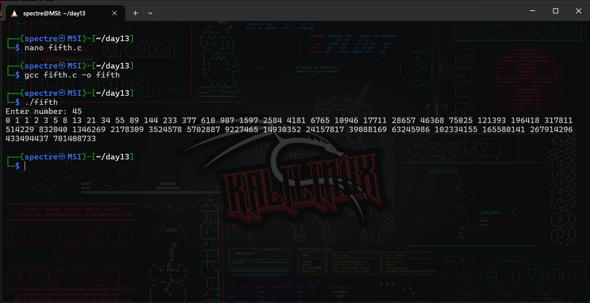
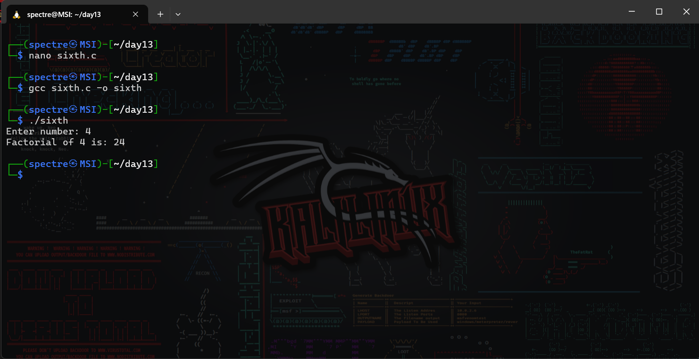
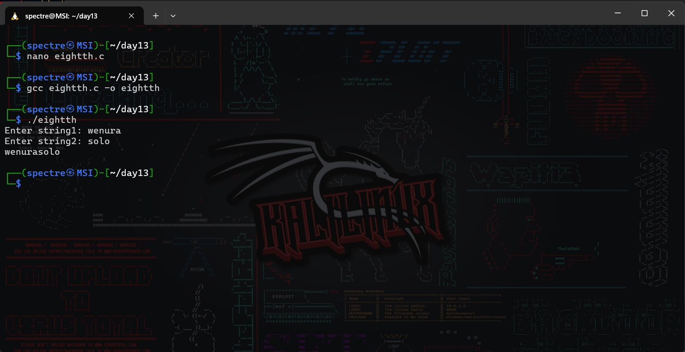
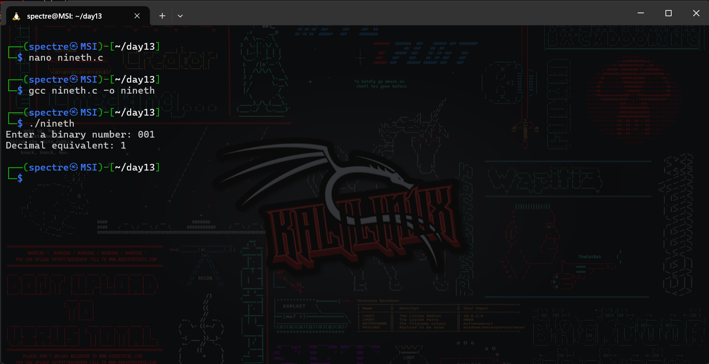
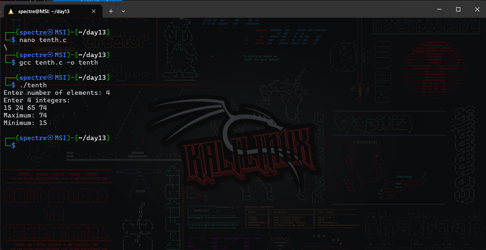
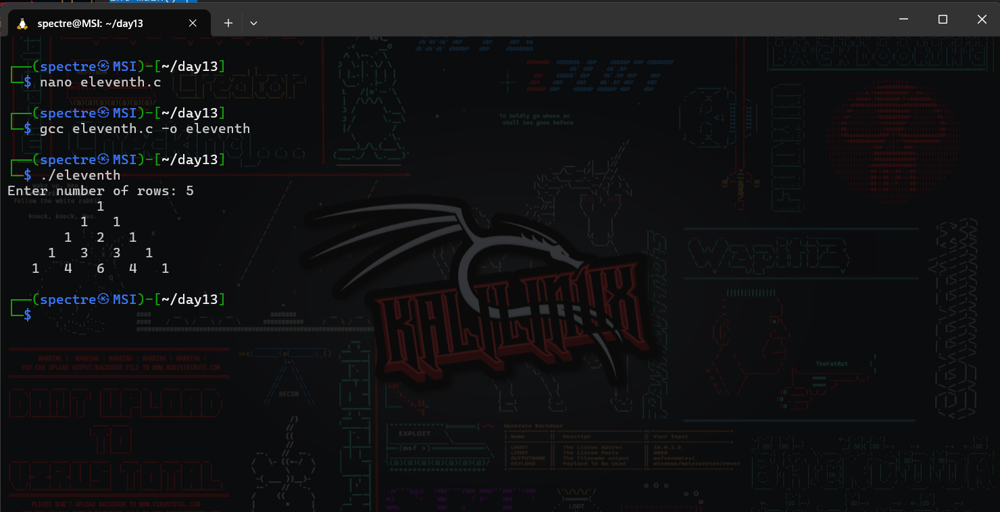

# Operating System Course - Day 13

[](https://en.cppreference.com/w/c)
[]()
[]()

## 📋 Daily Content

### 🎯 Programming Exercises
#### 1. Voting Eligibility Check
```c
// From code.txt lines 1-21
#include<stdio.h>
int main(){
    int age;
    printf("Enter your age: ");
    scanf("%d",&age);
    // Conditional logic here
}
```
**Explanation:**
- Accepts user age input
- Uses nested conditionals for eligibility check

#### 2. Fibonacci Series Generator
```c
// From code.txt lines 95-114
int x=0;
int y=1;
for(int i=1; i<=num; i++){
    printf("%d ",x);
    int z = x+y;
    x = y;
    y = z;
}
```
**Explanation:**
- Generates Fibonacci sequence iteratively
- Implements sequence using temporary variables

### 📊 Implementation Results
| Program | Description | Output |
|---------|-------------|--------|
| Voting Check | Age validation logic |  |
| Ternary Operator | Compact conditional |  |
| Weekday Mapping | Switch-case demo |  |
| Life Path Number | Numerology calculator |  |
| Fibonacci Series | Iterative sequence |  |
| Factorial Calc | Mathematical operation |  |
| While Loop Demo | Countdown example |  |
| String Concatenation | Text manipulation |  |
| Binary Converter | Base-2 to base-10 |  |
| Array Min/Max | Value extraction |  |
| Pascal's Triangle | Combinatorial output |  |

<div align="center">
📖 **Control Structures** | 🛠️ **Algorithms** | 📊 **Math Operations**
</div>