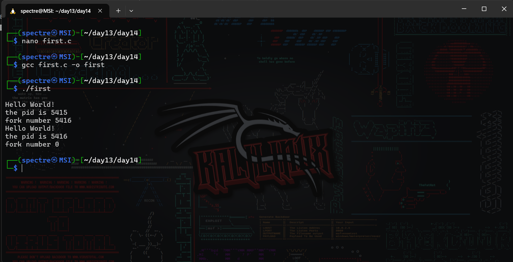
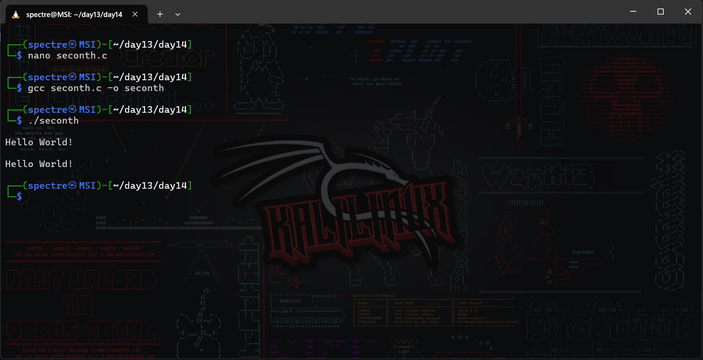
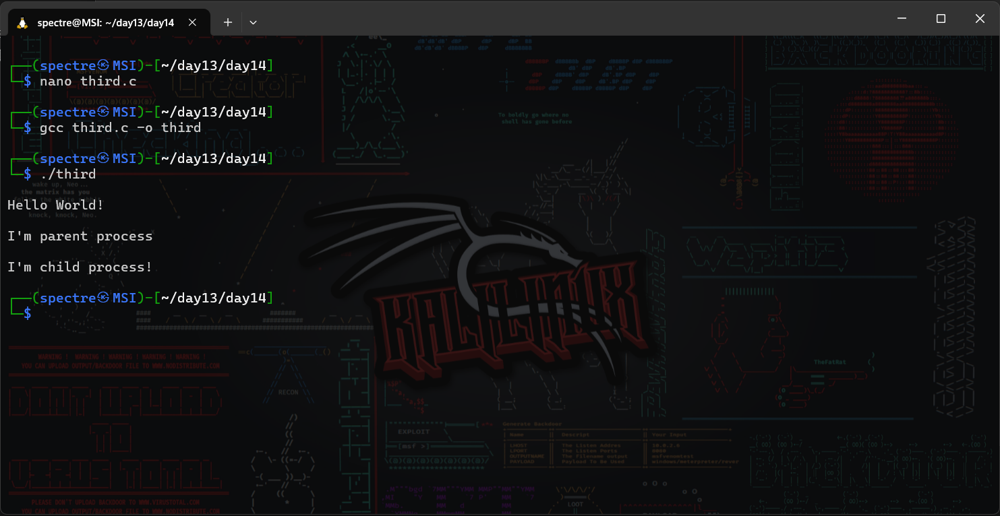
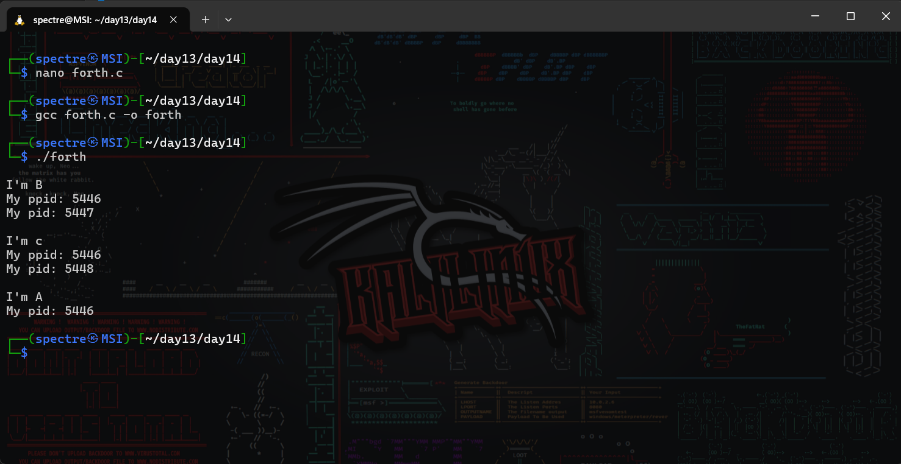

# Operating System Course - Day 14

[](https://en.cppreference.com/w/c)
[]()
[]()

## 📋 Daily Content

### 🎯 Programming Exercises
#### 1. Basic Process Creation
```c
// From code.txt lines 1-15
int main(){
    printf("\nHello World!");
    int f=fork();
    printf("PID: %d", getpid());
}
```
**Explanation:**
- Demonstrates basic fork() usage
- Shows parent/child process creation

#### 2. Process Hierarchy
```c
// From code.txt lines 61-92
int main(){
    int f = fork(); // Create B
    if (f == 0) {
        printf("\nI'm B");
    } else {
        fork(); // Create C
    }
}
```
**Explanation:**
- Creates process tree A → B and C
- Uses wait() for process synchronization

### 📊 Implementation Results
| Program | Description | Output |
|---------|-------------|--------|
| Basic Fork | Simple process creation |  |
| Process Tree | Hierarchy demonstration |  |
| Wait Example | Synchronization |  |
| Full Hierarchy | Multi-process creation |  |

<div align="center">
📖 **Process Management** | 🛠️ **Fork Operations** | 📊 **Synchronization**
</div>