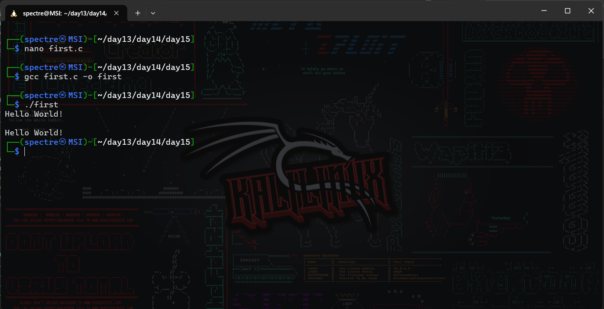
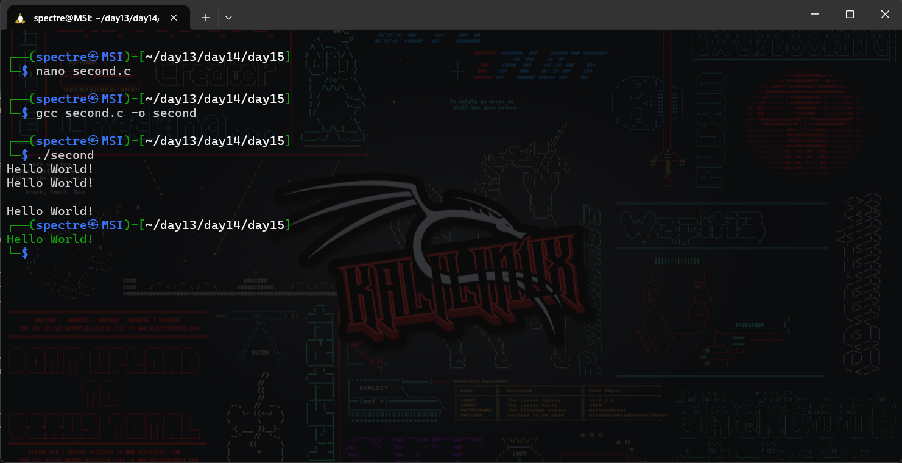
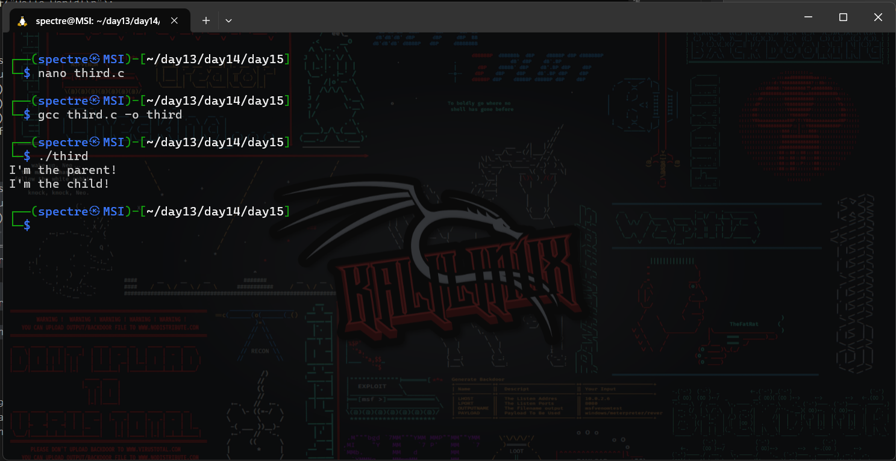
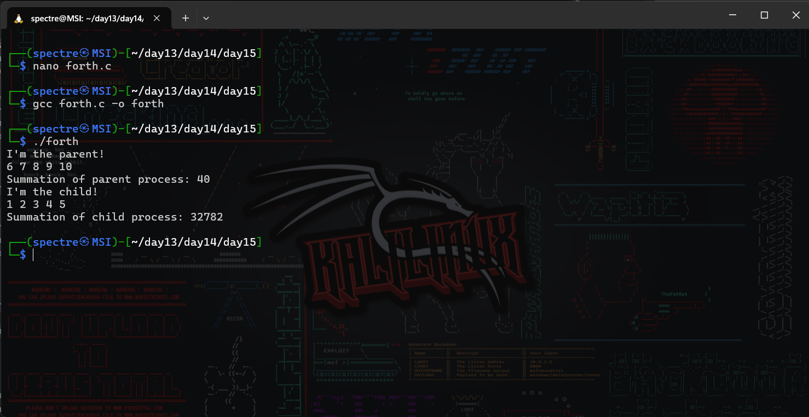
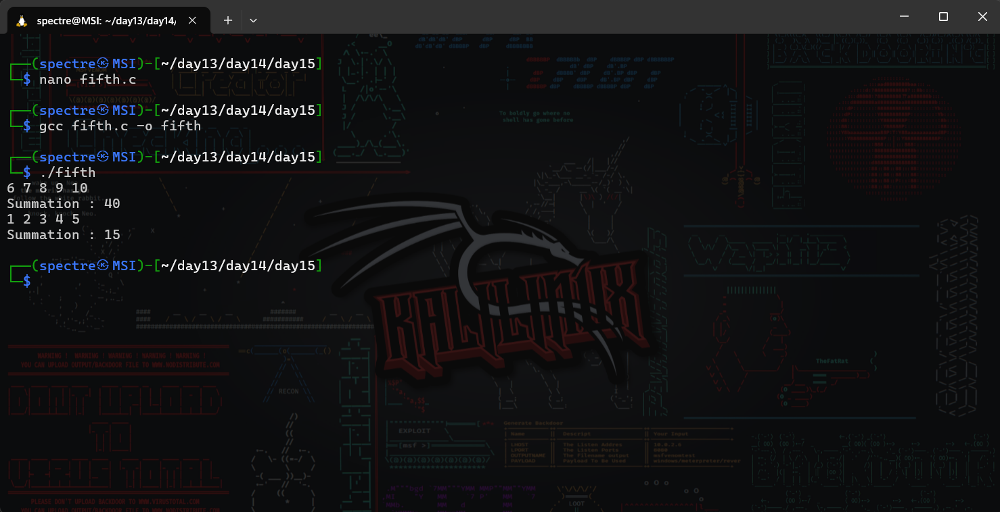

# Operating System Course - Day 15

## 📋 Daily Content

### 🎯 Programming Exercises

1. **Basic Process Creation**  
`fork()` system call demonstration
2. **Nested Process Creation**  
Double `fork()` hierarchy demonstration
3. **Parent-Child Identification**  
`fork()` return value handling
4. **Process-specific Calculations**  
Separate summation ranges for parent/child
5. **Parameterized Process Work**  
Different numerical ranges for parent/child

## 📊 Implementation Results

| Exercise | Description | Output |
|---|---|---|
| Basic Fork | Single process creation |  |
| Nested Fork | Process hierarchy demo |  |
| Parent-Child ID | Process identification |  |
| Range Calculations | Separate summations |  |
| Parameterized Work | Numerical range division |  |

## Technical Notes
- All programs use `unistd.h` for process management
- Tested on Windows Subsystem for Linux (WSL2)
- Output demonstrates concurrent process execution
- Includes proper header files for POSIX compliance