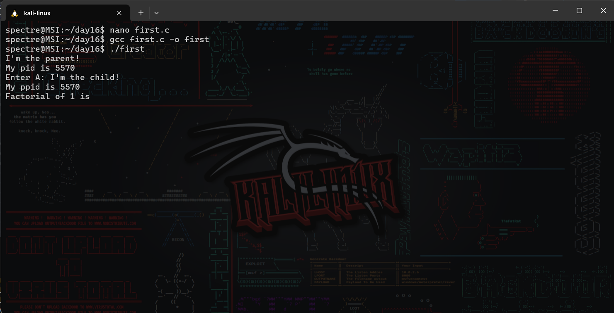
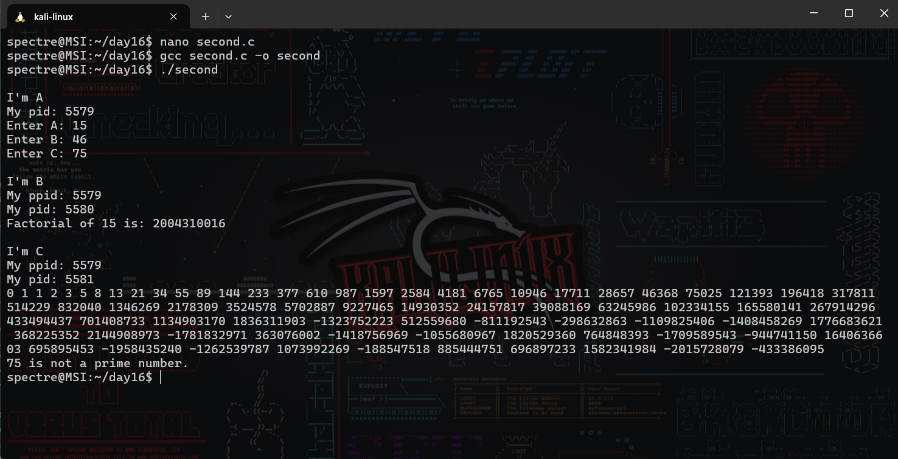

# Operating System Course - Day 16

## 📋 Daily Content

### 🎯 Programming Exercises

1. **Basic Process Hierarchy**  
`fork()` demonstration with parent/child identification
2. **Complex Process Tree**  
Multi-level process creation with waitpid()

## 📊 Implementation Results

| Exercise | Description | Output |
|---|---|---|
| Process Hierarchy | Parent-child relationship demo |  |
| Process Tree | Multi-level process creation |  |

## Technical Notes
- Uses `sys/wait.h` for process synchronization
- Implements PID/PPID tracking
- Demonstrates zombie process prevention
- Tested on Windows Subsystem for Linux