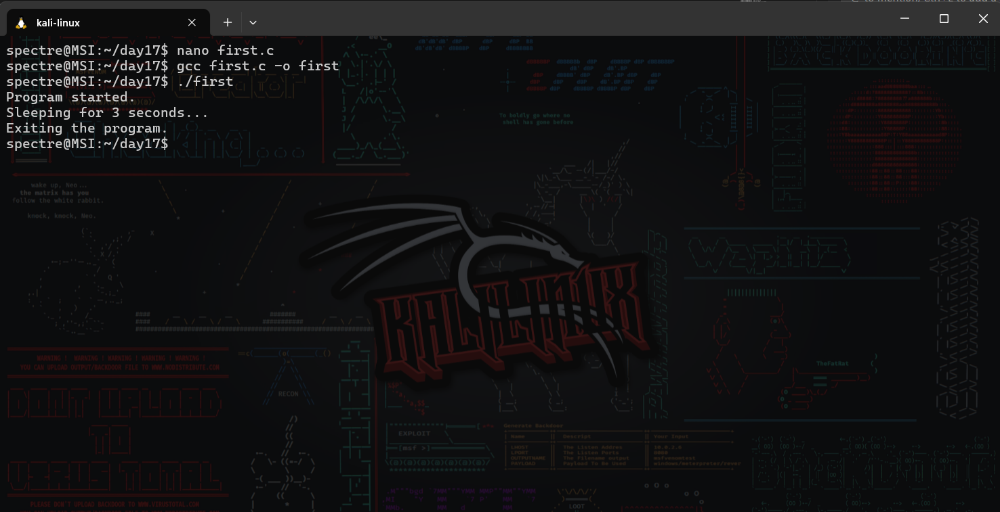
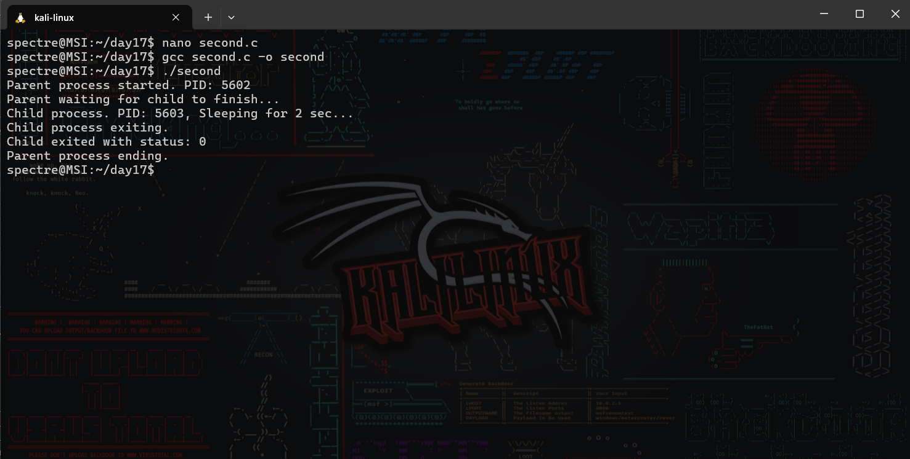
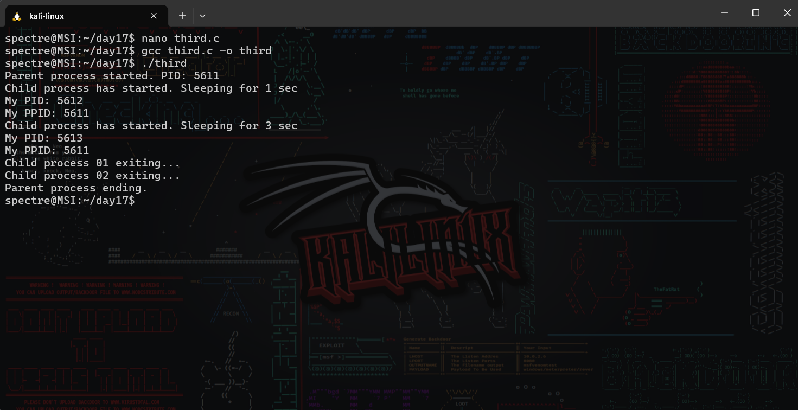

# Operating System Course - Day 17

## 📋 Daily Content

### 🎯 Programming Exercises

1. **Zombie Process Prevention**  
`wait()` system call implementation
2. **Sequential Process Execution**  
Ordered process creation with delays
3. **Process Status Monitoring**  
`WIFEXITED` and `WEXITSTATUS` usage

## 📊 Implementation Results

| Exercise | Description | Output |
|---|---|---|
| Zombie Prevention | Process cleanup demo |  |
| Sequential Execution | Ordered process flow |  |
| Status Monitoring | Exit code handling |  |

## Technical Notes
- Uses `sys/wait.h` for process synchronization
- Implements proper error handling with `perror()`
- Demonstrates exit status interpretation
- Tested on Windows Subsystem for Linux