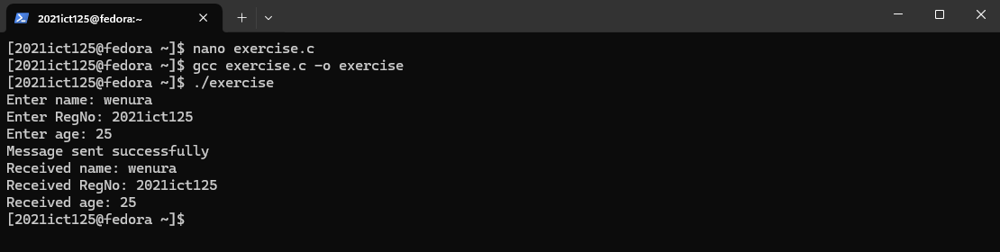

# Operating System IPC Implementation

[](https://en.cppreference.com/w/c)
[]()
[]()
[]()

## Project Overview
Implementation of Inter-Process Communication (IPC) using System V Message Queues in C, featuring:
- Parent-Child process communication
- Independent sender-receiver programs
- System call implementations for IPC
- Error handling and resource cleanup

## Code Examples

### 1. Parent-Child IPC (exercise.c)
Demonstrates message queue communication between parent and child processes:
- Parent process collects user data (name, registration number, age)
- Child process receives and displays the data
- Proper message queue creation and cleanup

### 2. Independent IPC Programs
#### Sender (sender.c)
- Creates message queue with unique key
- Accepts user input
- Sends data through message queue
- Implements error handling

#### Receiver (receiver.c)
- Connects to existing message queue
- Retrieves messages
- Displays received data
- Optional queue cleanup

## Implementation Results

### Exercise Output


### Sender-Receiver Communication


## Usage Instructions
1. Compile the programs:
   ```bash
   # For exercise.c
   gcc exercise.c -o exercise
   
   # For sender-receiver
   gcc sender.c -o sender
   gcc receiver.c -o receiver
   ```
2. Run the programs:
   ```bash
   # For exercise
   ./exercise
   
   # For sender-receiver (in separate terminals)
   ./sender
   ./receiver
   ```

## Key Features
- System V IPC implementation
- Error handling for IPC operations
- Resource cleanup
- Process synchronization
- User input validation

<div align="center">
  🖥️ **Systems Programming** | 🔄 **Inter-Process Communication** | 📚 **Message Queues**
</div>
